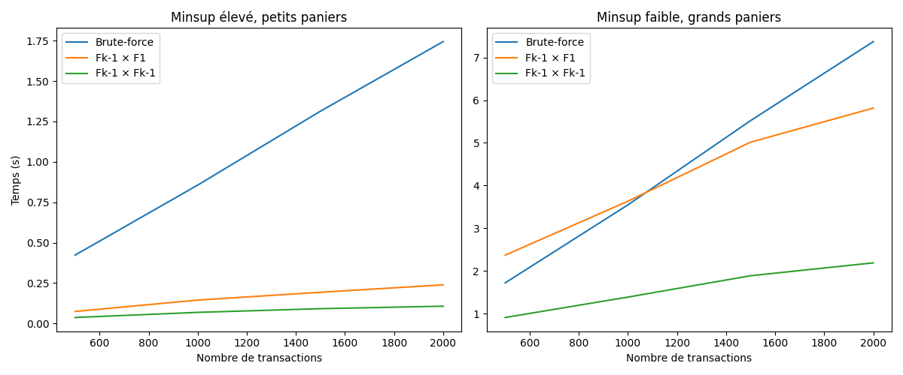

# I. Implémentation de trois méthodes de _Frequent Itemset Generation_

On teste 3 implémentations de génération d'itemsets fréquents pour la génération d'itemsets 
fréquents.

1. Bruteforce 
   - génération de tous les itemsets possibles de taille 1 à n (combinaisons de tous les items). 
   - Pour chaque itemset, calcule son support en parcourant toutes les transactions. 
   - Conserve uniquement ceux qui atteignent le support minimum. 
   - Probablement inefficace car teste même les itemsets qui ne peuvent pas être fréquents.
2. Stepwise $(F_{k-1} × F_1)$
   - Utilise la propriété __Apriori__ : si un itemset est fréquent, tous ses sous-ensembles le sont aussi.
   - Commence par les 1-itemsets fréquents ($F_1$), puis génère les candidats de taille k en combinant les itemsets fréquents de taille k-1 avec tous les 1-itemsets. 
   - Calcule le support uniquement pour ces candidats. S'arrête quand aucun nouvel itemset fréquent n'est trouvé.
3. Self-join $(F_{k-1} × F_{k-1})$
   - Version optimisée d'Apriori. 
   - Génère les candidats k-itemsets en joignant deux (k-1)-itemsets fréquents qui partagent leurs k-2 premiers éléments. 
   - Applique un élagage : élimine les candidats ayant un sous-ensemble non fréquent (marqués "N") avant de calculer leur support. 
   - Plus efficace car génère moins de candidats.

_Nb : L'efficacité de l'algorithme peut être améliorée de diverses façons (hasher les itemsets en buckets, réduction de transactions, partitioning, sampling, compteur d'itemsets dynamiques)_

## 2. Test des fonctions
cf notebooks
## 3. Résultats obtenus sur des ensembles de caractère
```markdown
Méthode Brute-force
1-itemsets
a 4 F
b 6 F
c 4 F
d 4 F
e 5 F
=========================
2-itemsets
a,b 4 F
a,c 2 F
a,d 3 F
a,e 4 F
b,c 4 F
b,d 4 F
b,e 5 F
c,d 2 F
c,e 3 F
d,e 3 F
=========================
3-itemsets
a,b,c 2 F
a,b,d 3 F
a,b,e 4 F
a,c,d 1 F
a,c,e 2 F
a,d,e 3 F
b,c,d 2 F
b,c,e 3 F
b,d,e 3 F
c,d,e 1 F
=========================
4-itemsets
a,b,c,d 1 F
a,b,c,e 2 F
a,b,d,e 3 F
a,c,d,e 1 F
b,c,d,e 1 F
=========================
5-itemsets
a,b,c,d,e 1 F
=========================

-------------

Méthode Fk-1 × F1
1-itemsets
a 4 F
b 6 F
c 4 F
d 4 F
e 5 F
=========================
2-itemsets
a,b 4 F
a,c 2 F
a,d 3 F
a,e 4 F
b,c 4 F
b,d 4 F
b,e 5 F
c,d 2 F
c,e 3 F
d,e 3 F
=========================
3-itemsets
a,b,c 2 F
a,b,d 3 F
a,b,e 4 F
a,c,d 1 F
a,c,e 2 F
a,d,e 3 F
b,c,d 2 F
b,c,e 3 F
b,d,e 3 F
c,d,e 1 F
=========================
4-itemsets
a,b,c,d 1 F
a,b,c,e 2 F
a,b,d,e 3 F
a,c,d,e 1 F
b,c,d,e 1 F
=========================
5-itemsets
a,b,c,d,e 1 F
=========================
6-itemsets
=========================

-------------

Méthode Fk-1 × Fk-1
1-itemsets
a 4 F
b 6 F
c 4 F
d 4 F
e 5 F
=========================
2-itemsets
a,b 4 F
a,c 2 F
a,d 3 F
a,e 4 F
b,c 4 F
b,d 4 F
b,e 5 F
c,d 2 F
c,e 3 F
d,e 3 F
=========================
3-itemsets
a,b,c 2 F
a,b,d 3 F
a,b,e 4 F
a,c,d 1 F
a,c,e 2 F
a,d,e 3 F
b,c,d 2 F
b,c,e 3 F
b,d,e 3 F
c,d,e 1 F
=========================
4-itemsets
a,b,c,d 1 F
a,b,c,e 2 F
a,b,d,e 3 F
a,c,d,e 1 F
b,c,d,e 1 F
=========================
5-itemsets
a,b,c,d,e 1 F
=========================
6-itemsets
=========================

-------------
```

# II. Comparaison des implémentations

## 1. Implémentation d'un générateur synthétique de transactions

Pour générer des transactions synthétiques, on peut utiliser la fonction `sample` du module `random` de Python.

```python
import random

items = ["bread", "milk", "diaper", "beer", "egg", "cola", "apple", "banana", "chocolate", "cheese", "yogurt", "cereal", "juice", "water", "meat", "fish", "rice", "pasta", "tomato", "lettuce"]

def generate_transactions(n_transactions, n_items, width_range):
    """
    Génère un dataset synthétique de transactions.
    """
    if n_items > len(items):
        raise ValueError(f"n_items ({n_items}) dépasse le nombre d'items disponibles ({len(items)})")

    available_items = items[:n_items]
    min_w, max_w = width_range

    transactions = []
    for _ in range(n_transactions):
        k = random.randint(min_w, max_w)
        transaction = random.sample(available_items, k)
        transactions.append(transaction)

    return transactions
```

Ensuite, un appel comme `generate_transactions(1000, 10, (2,5))` génèrera 1000 transactions :
```python
[
    ['milk', 'bread', 'diaper'],
    ['cola', 'egg', 'milk', 'bread'],
    ...
]
```

## 2. Benchmark des 3 méthodes: bruteforce, stepwise, et self-join

Pour comparer les performances des trois méthodes implémentées, nous avons réalisé un benchmark en utilisant le générateur de transactions synthétiques écrit à la question précédente. Nous avons fait varier le nombre de transactions de 500 à 2000 et mesuré le temps d'exécution moyen sur plusieurs lancements pour lisser les résultats. Deux scénarios distincts ont été testés, menant à la figure ci-dessous.



### Analyse des résultats

**Figure de gauche : La méthode brute-force se distingue**

Pour générer cette figure, nous avons utilisé les paramètres suivants :
- `minsup = 0.8` (support minimum élevé)
- `n_items = 15` (nombre total d'items)
- `width_range = (3, 5)` (paniers de petite taille)

Avec un support minimum élevé et des paniers de petite taille, la figure montre que la méthode `brute-force` est nettement moins performante. Cela s'explique par le fait que, contrairement aux méthodes optimisées, l'approche `brute-force` doit d'abord générer l'ensemble de *toutes* les combinaisons d'items possibles avant de calculer leur support. Même si la plupart de ces candidats sont rapidement éliminés, cette phase de génération initiale représente un coût de calcul important. Les méthodes `stepwise` et `self-join`, en revanche, construisent intelligemment un ensemble de candidats beaucoup plus restreint à partir des itemsets déjà connus comme fréquents, évitant ainsi le surcoût de la génération exhaustive.

**Figure de droite : Performances similaires**

Pour cette figure, les paramètres ont été ajustés pour créer un scénario plus complexe :
- `minsup = 0.1` (support minimum faible)
- `n_items = 15` (nombre total d'items légèrement plus grand)
- `width_range = (5, 8)` (paniers de plus grande taille)

Pour cette figure, avec un `minsup` faible et des paniers plus larges, on observe des performances étonnamment similaires entre les trois méthodes. Dans ce scénario, le faible seuil de support fait qu'un très grand nombre d'itemsets sont considérés comme fréquents. Par conséquent, même les méthodes `stepwise` et `self-join`, qui utilisent la propriété Apriori pour élaguer, se retrouvent à générer un nombre de candidats très important, approchant la complexité de la méthode `brute-force`. L'avantage de l'élagage diminue lorsque la quasi-totalité des sous-ensembles sont fréquents. La charge de travail principale devient alors le parcours des transactions pour compter le support de chaque candidat, une étape commune aux trois approches, ce qui explique pourquoi leurs temps d'exécution convergent.


# III. Comparaison avec les implémentations de _MLxstend_ et _Spark MLlib_

## 1. _MLxstend_ VS implémentation from scratch

L'algorithme Apriori identifie les ensembles d'éléments fréquents en comptant la fréquence d'apparition des éléments ou combinaisons d'éléments dans un ensemble de données transactionnelles. 

- Nos implémentations listent tous les candidats _(fréquents, peu fréquents et élagués)_, en les marquant F, I ou N, tandis que _mlxtend_ n'affiche que les ensembles d'éléments atteignant le seuil de support minimal (environ 0,6 dans notre cas). 
- En comparant uniquement les ensembles d'éléments fréquents, nos résultats et ceux de mlxtend sont identiques : 
  - les ensembles fréquents à 1 élément sont `Bread, Milk, Diapers, Beer` et les ensembles fréquents à 2 éléments sont `(Beer, Diapers), (Bread, Diapers), (Bread, Milk), (Diapers, Milk)`. 
  - Aucun ensemble à 3 éléments n'atteint le seuil de support; ils n'apparaissent donc pas dans mlxtend et notre code marque le seul candidat comme peu fréquent. 
- Ainsi, les différences apparentes proviennent uniquement du filtrage et de la présentation, et non des résultats de l'algorithme.

| Taille | Itemsets                                                          |
|--------| ----------------------------------------------------------------- |
| 1-item | Bread, Milk, Diapers, Beer                                        |
| 2-item | (Beer, Diapers), (Bread, Diapers), (Bread, Milk), (Diapers, Milk) |
| 3-item | None                                                              |

## 2. _Spark MLlib_ : algorithme `FP-Growth`

On peut reprendre cette définition de _Data mining : concepts and techniques_ pour l'algorithme FP-Growth.

Une méthode intéressante dans cette approche est appelée croissance de motifs fréquents, ou simplement croissance FP, qui adopte une stratégie de type « diviser pour régner » comme suit.

1. Premièrement, elle compresse la base de données représentant les éléments fréquents en un arbre de motifs fréquents, ou arbre FP, qui conserve les informations d'association des ensembles d'éléments.
2. Elle divise ensuite la base de données compressée en un ensemble de bases de données conditionnelles (un type particulier de base de données projetée), chacune étant associée à un ensemble d'éléments trouvé jusqu'à présent, ou « fragment de motif », et explore chaque base de données séparément. 
   - Pour chaque « fragment de motif », seuls ses ensembles de données associés doivent être examinés.

> Cette approche peut donc réduire considérablement la taille des ensembles de données à analyser, ainsi que le nombre de motifs examinés.

# Bibliographie

- Data mining : concepts and techniques, Section 4.2 (2023)
- Introduction to Data Mining (2006)